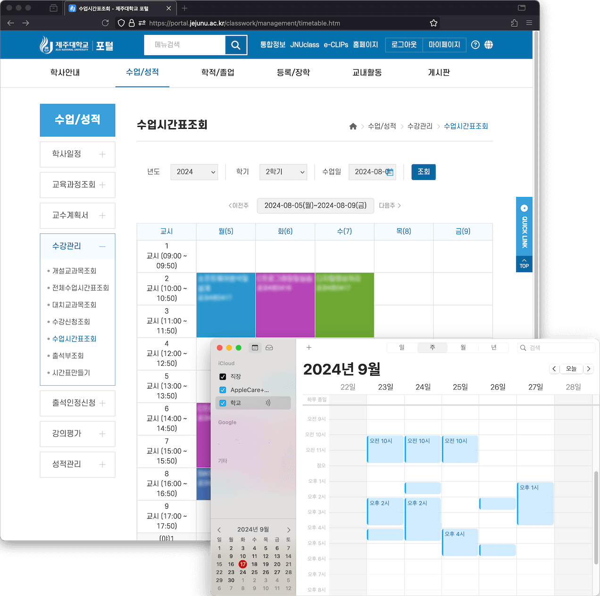

제주대학교 강의 시간표 데이터를 주기적으로 icalendar 표준으로 변환해서 캘린더 클라이언트에 구독하는 프로젝트입니다.



|                                                                   [컨버터 명세](src/tests/index.test.ts) 커버리지                                                                   |                                                                                 AWS S3 업로드 상태                                                                                  |
| :---------------------------------------------------------------------------------------------------------------------------------------------------------------------------------: | :---------------------------------------------------------------------------------------------------------------------------------------------------------------------------------: |
| [](https://github.com/mu-hun/jejunu-icalendar-server/actions/workflows/test.yml) | [](https://github.com/mu-hun/jejunu-icalendar-server/actions/workflows/cron.yml) |

## 관리 시 참고 사항

### 시간표 데이터 받기

- GET https://portal.jejunu.ac.kr/api/patis/timeTable.jsp
- query params: -`sttLsnYmd`, `endLsnYmd` 값 형태는 `YYYYMMDD`

> 예) https://portal.jejunu.ac.kr/api/patis/timeTable.jsp?sttLsnYmd=20240902&endLsnYmd=20241221

### 보강, 휴강, 온라인 판단 로직

```js
const isNine = (str) => str && str.substr(0, 1) == '9';

if (item.cclctYn == 'Y') {
  if (isNine(item.aftrSplctLttmSe)) {
    // 온라인 영상
    td += '<span class="label label-red">온</span>';
  } else {
    td += '<span class="label label-cancle">휴</span>';
  }
} else if (item.splctYn == 'Y') {
  const isUntactNine = isNine(item.untactLsnMthdSe);
  const isAftrNine = isNine(item.aftrSplctLttmSe);

  if (isUntactNine && isAftrNine) {
    // 온라인 (녹화)
    td += '<span class="label label-red">온</span>';
  } else if (isUntactNine) {
    // 온라인 (실시간)
    td += '<span class="label label-blue">온</span>';
  } else {
    td += '<span class="label label-supplement">보</span>';
  }
}
```
