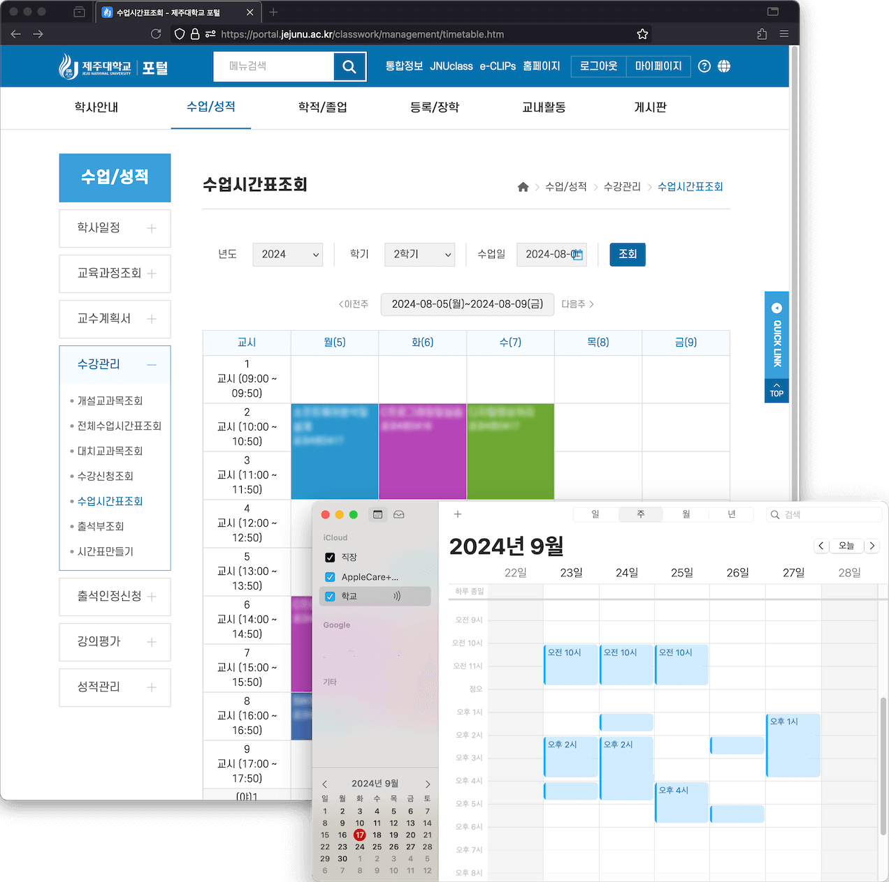
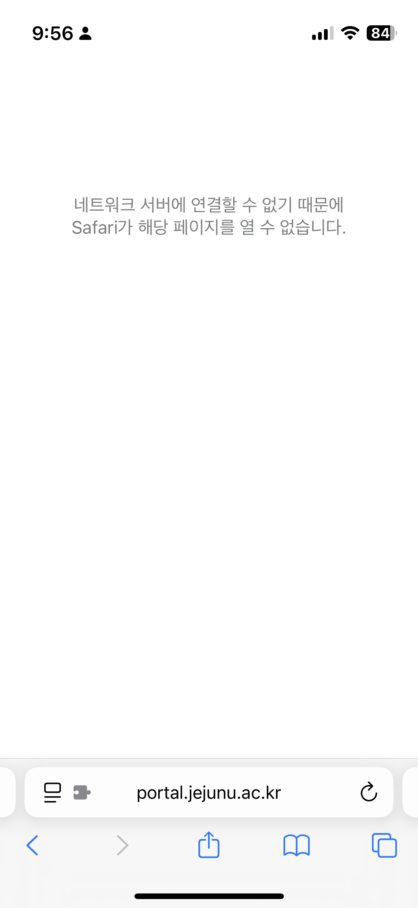

📅 제주대학교 강의 시간표 데이터를 매일 갱신하여 기기의 기본 캘린더 클라이언트(Google, Apple Calendar 등)에서 구독할 수 있는 icalendar 서버를 구축하는 웹 오토메이션 프로젝트입니다.



|                                                                   [컨버터 명세](src/tests/index.test.ts) 커버리지                                                                   |                                                                                 AWS S3 업로드 상태                                                                                  |
| :---------------------------------------------------------------------------------------------------------------------------------------------------------------------------------: | :---------------------------------------------------------------------------------------------------------------------------------------------------------------------------------: |
| [](https://github.com/mu-hun/jejunu-icalendar-server/actions/workflows/test.yml) | [](https://github.com/mu-hun/jejunu-icalendar-server/actions/workflows/cron.yml) |

## 작업 동기

지난 학기<sup>(2024년 1학기)</sup>, 강의 일정의 잦은 변동(공휴일 대체 수업, 교수님의 개인 사정으로 인한 휴강 등)을 제주대학교 포털 웹 서비스를 통해 확인하는 과정에서 아래와 같은 불편을 반복적으로 겪었습니다:

1. 포털 로그인 지연: 로그인 과정에서 필수가 아닌 부가적인 내부 로직으로 인해 약 3초가량 불필요한 지연이 발생하고 있습니다. 이에 임시 해결책으로 [SSO 요청만 바로 수행하는 사용자 스크립트](https://github.com/mu-hun/jejunu-sw/blob/e190950/portal.user.js#L21)를 직접 작성해서 개인적으로 이용하고 있습니다.
2. iOS 환경의 제약: iOS에서 [비공개 릴레이](https://support.apple.com/ko-kr/102602)를 활성화할 경우, 포털 웹 및 앱 서비스의 요청 지연이 사용이 불가능할 정도로 길어져 데스크탑 환경을 주로 이용해야 했습니다.
3. iOS Safari 호환성 문제: iPhone에서 포털 로그인 페이지 로드가 되지 않는 문제가 자주 발생해, iOS용 Firefox와 같은 서드파티 브라우저를 대신 사용해야 했습니다.

   

이와 같은 문제를 해결하기 위해 강의 시간표 데이터를 매일 갱신하여 [icalendar 표준](https://icalendar.org/) 형식의 `.ics` 파일로 변환하여, 이를 외부 캘린더 클라이언트(Google Calendar, Apple Calendar 등)에서 구독할 수 있도록 지원하는 HTTP GET 서버 파이프라인을 구축했습니다.

<!-- TODO: 아이폰 및 애플워치 스크린샷 첨부하기 -->

이전보다 시간표 변동 사항을 기기에서 바로 확인하는 편리한 경험을 누리고 있는 중입니다.

## 테스트 주도 구현

휴강, 보강, 연강 등 다양한 경우를 포함한 제주대학교 포털의 강의 시간표 데이터를 분석하여, 각 경우에 적합한 강의 시간표 데이터 입력과 icalendar 형식의 출력을 같이 준비했습니다.

준비된 데이터를 기반으로 단위 테스트를 우선 작성한 후 icalendar 형식으로 변환하는 유틸리티를 구현하였으며, 테스트를 통해 변환의 정확성을 검증했습니다.

1. 단위 테스트 케이스 준비 작업
   - 강의 시간표의 여러 상황(휴강, 보강 등)에 대한 데이터를 포함한 [단위 테스트 케이스 그룹 파일](src/tests/testcases.json) 준비
2. 단위 테스트 명세 작성
   - 준비한 테스트 케이스 입력을 기반으로 [단위 테스트 명세](src/tests/index.test.ts#L17-L77)를 작성해 [icalendar 변환 유틸리티](src/iCalConverter.ts)를 구현했습니다.
3. 통합 테스트 전용 덤프 데이터 및 기대 출력 파일 준비
   - 강의 시간표 [샘플 덤프 데이터](src/tests/response.json)와 기대 출력 [`.ics` 파일](src/tests/excepted.ics)을 준비하고, [통합 테스트](src/tests/index.test.ts#L79-L86)를 수행했습니다.

## 관리 시 참고 사항

### 시간표 데이터 받기

- GET https://portal.jejunu.ac.kr/api/patis/timeTable.jsp
- query params: -`sttLsnYmd`, `endLsnYmd` 값 형태는 `YYYYMMDD`

> 예) https://portal.jejunu.ac.kr/api/patis/timeTable.jsp?sttLsnYmd=20240902&endLsnYmd=20241221

### 보강, 휴강, 온라인 판단 로직

```js
const isNine = (str) => str && str.substr(0, 1) == '9';

if (item.cclctYn == 'Y') {
  if (isNine(item.aftrSplctLttmSe)) {
    // 온라인 영상
    td += '<span class="label label-red">온</span>';
  } else {
    td += '<span class="label label-cancle">휴</span>';
  }
} else if (item.splctYn == 'Y') {
  const isUntactNine = isNine(item.untactLsnMthdSe);
  const isAftrNine = isNine(item.aftrSplctLttmSe);

  if (isUntactNine && isAftrNine) {
    // 온라인 (녹화)
    td += '<span class="label label-red">온</span>';
  } else if (isUntactNine) {
    // 온라인 (실시간)
    td += '<span class="label label-blue">온</span>';
  } else {
    td += '<span class="label label-supplement">보</span>';
  }
}
```
